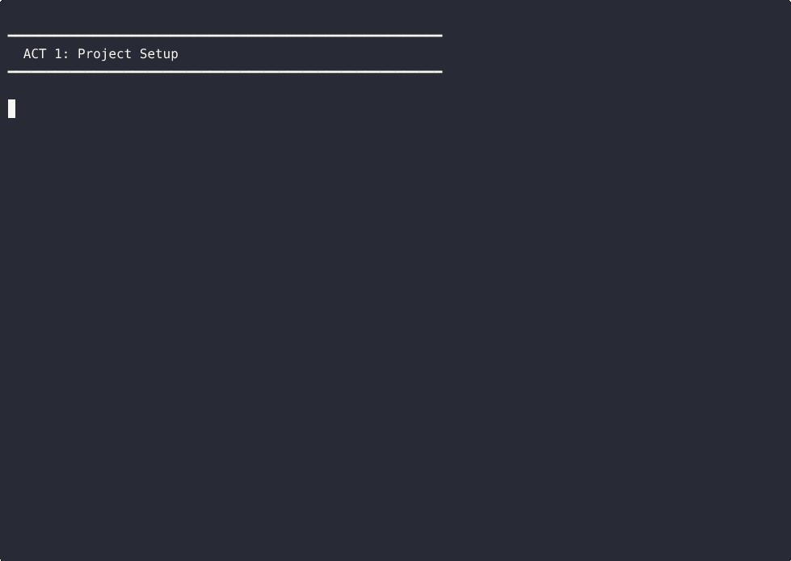

# HELIX

A document discipline for AI-assisted software development. HELIX is a
methodology and artifact catalog: templates for the documents your project
needs at every level — vision, requirements, design, tests, deploy, metrics —
plus a single alignment skill that keeps them in sync as the work moves.

HELIX runs on runtimes. [DDx](https://documentdrivendx.github.io/ddx/) is
the reference runtime — it provides the agent runtime, the tracker, and the
execution loop that turn aligned artifacts into running code. Databricks Genie
and Claude Code are target runtimes. HELIX itself is content (templates,
prompts, methodology spec) plus the alignment skill. It does not ship a CLI,
a tracker, or a runtime.

**[Documentation](https://documentdrivendx.github.io/helix/)** · **[Demo Reels](https://documentdrivendx.github.io/helix/demos/)** · **[Getting Started](https://documentdrivendx.github.io/helix/use/getting-started/)**



## Local Microsite Review

Use the standard startup script when reviewing the Hugo site locally:

```bash
bash website/scripts/serve-local.sh
```

The local review site lives at `http://eitri:1315/helix/`. Keep `/helix` in
review URLs; root paths such as `http://eitri:1315/artifact-types/...` are not
the local site shape and should be treated as invalid.

## The Seven Activities

HELIX names seven kinds of work in software development:

| Activity | Owns artifact types like… |
|---|---|
| **Discover** | Product vision, business case, competitive analysis, opportunity canvas |
| **Frame** | PRD, feature specifications, user stories, principles, cross-cutting requirements |
| **Design** | Architecture, ADRs, solution designs, technical designs, contracts |
| **Test** | Test plans, story test plans, security tests |
| **Build** | Implementation plan, executed work in the runtime's tracker |
| **Deploy** | Runbook, deployment checklist, monitoring setup, release notes |
| **Iterate** | Metric definitions, metrics dashboard, improvement backlog |

Activities are connected by an **authority order** — vision governs PRD,
PRD governs features, features govern designs, designs govern tests, tests
govern code. When two artifacts disagree, the higher one wins. Work moves
between activities in every direction: a failing test reveals a missing
requirement; a production metric revises the PRD; a vision update propagates
downstream.

## Install (DDx Runtime)

The fastest path to running HELIX is the DDx runtime.

First, install [DDx](https://documentdrivendx.github.io/ddx/):

```bash
curl -fsSL https://raw.githubusercontent.com/DocumentDrivenDX/ddx/main/install.sh | bash
```

Then install HELIX as a DDx plugin:

```bash
ddx install helix
```

This adds HELIX's artifact-type catalog and alignment skill to your DDx
project. You'll also want an agent runtime —
[Claude Code](https://claude.ai/claude-code) or `codex` — plus `git`.

Other runtimes (Databricks Genie, Claude Code as a standalone skill) are in
progress.

## Quick Start

Shape intent into governed work, then let DDx drain the ready queue:

```bash
helix input "Build a REST API for managing bookmarks"
ddx agent execute-loop
```

The first command runs HELIX's alignment skill against your project's
artifacts, identifies what needs to change to support the new intent, and
emits work items in the DDx tracker. The second runs DDx's bounded execution
loop, dispatching agents to drain the queue. As work happens, the alignment
skill keeps the governing artifacts in sync.

Inside a Claude Code session, HELIX skills are available as slash commands.
Skill consolidation is in progress; today's working surface:

| Command | What it does |
|---|---|
| `/helix-input "build a bookmarks API"` | Shape intent into governed work items |
| `/helix-align` | Reconcile the artifact tree top-down; emit a plan |
| `/helix-frame` | Create or refine vision, PRD, feature specs |
| `/helix-design auth` | Iteratively design a subsystem |
| `/helix-evolve "add OAuth"` | Thread a new requirement through the artifacts |
| `/helix-review` | Fresh-eyes review of recent work |

## Where the Artifacts Live

HELIX project artifacts live under `docs/helix/`:

```
docs/helix/
├── 00-discover/    # Vision, business case, competitive analysis
├── 01-frame/       # PRD, feature specs, user stories
├── 02-design/      # Architecture, ADRs, solution designs, technical designs
├── 03-test/        # Test plans
├── 04-build/       # Implementation plans, executed work evidence
├── 05-deploy/      # Runbooks, monitoring, release notes
└── 06-iterate/     # Metrics, improvement backlog, alignment reviews
```

Numeric prefixes are a reading-order convention. They do not imply that
activities run in sequence — they don't.

## Where to Read Next

- [The Thesis](https://documentdrivendx.github.io/helix/why/the-thesis/) — what HELIX is and what it's for
- [Activities](https://documentdrivendx.github.io/helix/reference/glossary/activities/) — the seven kinds of work, with examples
- [Artifact Types](https://documentdrivendx.github.io/helix/artifact-types/) — the catalog of templates and prompts
- [Artifacts](https://documentdrivendx.github.io/helix/artifacts/) — this project's own governing documents, as a worked example
- [Workflow](https://documentdrivendx.github.io/helix/use/workflow/) — how the alignment loop runs

## DDx as Runtime

[DDx](https://documentdrivendx.github.io/ddx/) is where execution lives. DDx
provides the work tracker (beads), the agent dispatch harness, the
execution-evidence store, the document graph, and the queue-drain loop. HELIX
provides the methodology, the artifact catalog, and the alignment skill that
runs on top.

The split is intentional: HELIX is portable methodology + content. DDx is one
runtime that knows how to run that content. Other runtimes can run the
same content with their own per-runtime packages.
