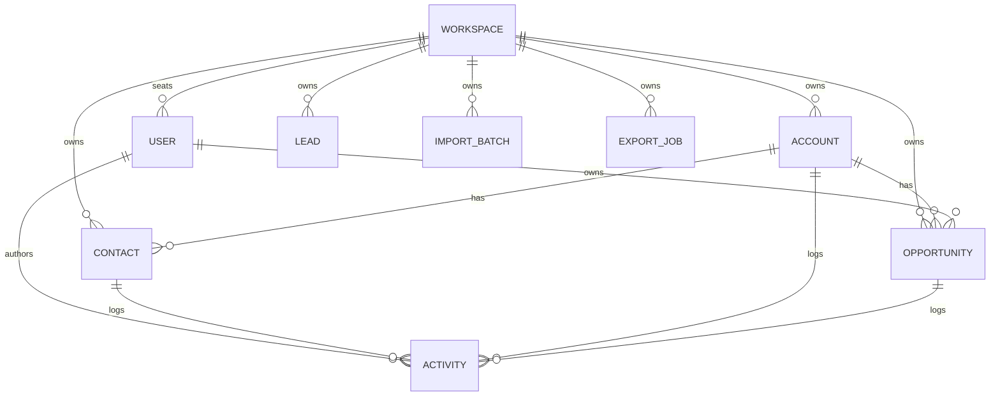

---
ddx:
  id: crm.solution-design
  depends_on:
    - crm.vision
    - crm.prd
---

# Solution Design

**Governing artifacts**: `crm.vision`, `crm.prd`

## Scope

- Worked-example design artifact for the CRM MVP defined in `crm.prd`.
- Carries frame-phase intent into a solution-level model: data boundaries,
  workflows, access control, reporting outputs, and integration seams.
- Intentionally defers concrete stack selection, infrastructure, and runtime
  implementation planning to later ADRs or to a dedicated CRM repository if
  this example ever graduates from demo planning.

## Requirements Mapping

| PRD requirement | Design response | Primary design area | Priority |
|---|---|---|---|
| R-1 authenticated multi-user access | Model every record inside a single workspace boundary and evaluate every action against role + workspace membership | Workspace and access boundary | P0 |
| R-2 core entity CRUD | Keep accounts, contacts, leads, opportunities, and activities as first-class records with shared ownership rules | Core record model | P0 |
| R-3 activity logging | Treat activity as a cross-record timeline attached to contact, account, or opportunity records | Activity timeline | P0 |
| R-4 pipeline view | Make opportunity stage, owner, value, and next-step fields the source for board and list views | Pipeline read model | P0 |
| R-5 owner/team views | Separate default visibility by role while preserving a shared team source of truth | Role-scoped views | P0 |
| R-6 and R-8 CSV import/export | Introduce explicit import and export workflow boundaries owned by admins | Data movement | P0 |
| R-7 search | Provide a workspace-scoped search surface across the core records | Search surface | P0 |
| R-9, R-10, R-12, R-15 | Reserve extension points for reminders, email capture, audit history, and read-only integrations | Later-phase extensions | P1/P2 |

## Domain Entities and Relationships

| Entity | Purpose | Key relationships |
|---|---|---|
| Workspace | Tenant boundary for one customer team | Owns users, records, imports, and exports |
| User | Workspace member with role `rep`, `manager`, or `admin` | Belongs to one workspace; owns opportunities; authors activities |
| Account | Company-level record | Has many contacts and opportunities |
| Contact | Person record | Belongs to an account; can appear in activities |
| Lead | Unqualified prospect record | Lives in the workspace until qualified or disqualified |
| Opportunity | Revenue-bearing deal record | Belongs to one account and one owner; appears in pipeline views |
| Activity | Time-stamped call, email, meeting, or note | Authored by a user and attached to a contact, account, or opportunity |
| Import Batch | Admin-owned workflow record for CSV upload, mapping, preview, and commit | Creates or updates accounts, contacts, or leads |
| Export Job | Admin-owned workflow record for CSV extraction | Reads filtered record sets for downstream analysis or migration |

### Relationship notes

- `Workspace` is the hard isolation boundary described in `crm.prd`; no
  design here assumes cross-workspace sharing.
- `Lead` stays distinct from `Contact` and `Opportunity` in the MVP because
  the PRD defines a separate status model for leads. The exact conversion flow
  from lead to shared account/contact/opportunity records remains an open
  decision below.
- `Activity` is the shared history surface that makes the CRM a single source
  of truth for reps and managers. Every activity must preserve author and
  timestamp because those fields support both daily workflow and later
  reporting.
- `Import Batch` and `Export Job` are support entities derived from the P0 CSV
  requirements. They exist to make import/export explicit without deciding the
  eventual technology stack.

## Solution Shape

The MVP can stay product-simple if it is organized around a few stable
solution boundaries instead of many specialized subsystems:

1. **Workspace and access boundary**: owns authentication state, user seats,
   role checks, and workspace isolation.
2. **Core record services**: CRUD surfaces for accounts, contacts, leads,
   opportunities, and activities.
3. **Pipeline and search views**: read models derived from the core records so
   reps and managers can review work quickly.
4. **Import/export workflows**: admin-only flows that move records between CSV
   files and the workspace.
5. **Reporting and integration seams**: outputs that summarize pipeline health
   and later connect to email capture or external reporting tools.

This keeps the design aligned with the PRD's "day-one usable" goal: a small
number of opinionated surfaces around the daily work of a small sales team.

## Major Workflows

### 1. Workspace creation and seat setup

- A new customer creates a workspace and the creator becomes its first admin.
- The admin invites reps and managers, assigns seats, and establishes the
  initial owner/team visibility model.
- This workflow is the entry point for the PRD's authenticated multi-user SaaS
  requirement and the "single shared source of truth" goal.

### 2. Admin import of contacts, accounts, and leads

- An admin uploads a CSV, maps columns, previews the first rows, and commits
  the import.
- The import flow must preserve row-level outcomes so failures can be reported
  without hiding partial success.
- Imported records land inside the same workspace-scoped core model used by
  manual record creation; import is not a parallel data store.

### 3. Rep record maintenance and activity logging

- Reps create or update contacts, leads, accounts, and opportunities they own
  or are allowed to edit.
- Reps log calls, emails, meetings, and notes directly on the working record
  so context does not escape into inboxes or chat.
- Lead qualification moves a prospect toward shared account/contact/opportunity
  records, but the exact transition mechanics are intentionally left open until
  product judgment is applied.

### 4. Opportunity pipeline management and weekly review

- Opportunities are grouped by stage and sorted by close date for the pipeline
  board and supporting list views.
- Reps default to their own book of business; managers default to a team view.
- Opportunity cards must surface owner, account, value, and next-step date
  because those are the minimum facts needed for the PRD's sub-5-minute
  pipeline review goal.

### 5. Search, export, and follow-up analysis

- Users search by name, email, or company across workspace records.
- Admins export filtered record lists as CSV when they need offline analysis,
  migration, or sharing outside the product.
- Reporting views and exports should be derived from the same core records so
  managers do not reconcile between multiple "official" sources.

## Roles and Permissions

The PRD already defines the three roles. The solution design turns those role
names into clear operational boundaries:

| Capability | Rep | Manager | Admin | Notes |
|---|---|---|---|---|
| View own records | Yes | Yes | Yes | Baseline access |
| View team/workspace records | Read | Yes | Yes | Exact "team" definition is still open |
| Create and edit own opportunities and activities | Yes | Yes | Yes | P0 daily workflow |
| Create and edit team opportunities | No | Yes | Yes | Manager scope follows team model |
| Create and edit all workspace records | No | No | Yes | Admin override |
| Manage users and seats | No | No | Yes | Required for onboarding |
| Run CSV import/export | No | Optional | Yes | PRD requires admin import/export; manager delegation is optional later |
| Access audit-only operational views | No | Optional | Yes | Audit log itself is P1 |

### Permission design notes

- The lowest-risk default is role checks layered on top of workspace
  membership, with ownership rules for reps and broader scope for managers and
  admins.
- The PRD leaves one meaningful product question open: whether manager scope
  follows reporting line, territory, or all records in a workspace. That
  choice changes visibility rules more than the role names themselves do.
- Admin is the escape hatch for onboarding, import/export, and corrective data
  maintenance, but the product should still bias toward opinionated defaults
  rather than per-field customization.

## Reporting

Reporting in this CRM is not a separate analytics product. It is the set of
views and exports needed to make pipeline state trustworthy in day-to-day
operations.

### Core reporting outputs

| Reporting output | Primary users | Source records | Why it matters |
|---|---|---|---|
| Pipeline board by stage | Reps, managers | Opportunities | Weekly review and daily prioritization |
| Pipeline list by owner / close period | Managers, admins | Opportunities | Team coaching and forecast inspection |
| Next-step due / overdue view | Reps, managers | Opportunities | Supports freshness and follow-up habits |
| Activity timeline on records | Reps, managers | Activities plus linked records | Replaces inbox-only context |
| CSV export by filtered list | Admins | Any exported entity set | Analysis, migration, and procurement confidence |

### Metric implications from the PRD

- **Pipeline freshness** depends on opportunity update timestamps and
  next-step fields being reliable enough to query without manual cleanup.
- **Weekly active reps** depends on activity authorship and timestamps.
- **Time-to-first-value** depends on being able to identify the team's first
  meaningful pipeline review event, whether via product telemetry or an
  equivalent operational signal.

### Reporting design note

The design should preserve the raw facts needed for reporting inside the core
records first. Whether later phases implement live queries, materialized read
models, or a separate analytics pipeline is an ADR concern, not an MVP design
assumption.

## External Integrations

| Integration surface | Scope | MVP status | Design implication |
|---|---|---|---|
| CSV import | Admin uploads contacts, accounts, or leads | MVP | Needs a durable import workflow with preview and row-level outcomes |
| CSV export | Admin exports filtered record sets | MVP | Needs entity-to-CSV field mapping and permission checks |
| Email-to-activity capture | Best-effort inbound email logging | Later (P1) | Needs workspace email address, identity matching, and ambiguous-match policy |
| Read-only API / webhooks | Downstream reporting or system sync | Later (P2) | Needs stable record identifiers and outbound event boundaries |
| SSO | Auth provider integration | Later (P2) | Needs auth abstraction without changing the workspace model |

### Integration boundaries

- The PRD's non-goals still apply here: no marketing automation, support
  ticketing, billing, or broad CRM customization in MVP.
- External integrations should extend the same core workspace model; they
  should not introduce competing ownership or reporting paths.
- Migration from incumbent CRMs matters commercially, but full migration
  tooling is outside MVP and should be treated as later product work.

## MVP vs Later Scope Boundaries

| Bucket | Included work |
|---|---|
| MVP | Workspace auth, fixed roles, accounts/contacts/leads/opportunities/activities, pipeline board + list views, search, CSV import/export, owner/team scoped views |
| Later | Reminders, email capture, bulk edit, audit log, saved views, renamed stages, read-only API/webhooks, SSO |
| Not in scope here | Marketing automation, support ticketing, quote-to-cash, AI scoring/generation, native mobile apps, on-prem deployment, heavy customization, implementation work inside the HELIX repo |

### Boundary note

The design artifact should make downstream work easier by clarifying where the
MVP stops. It should not silently pull P1/P2 or non-goal scope back into the
core solution.

## Open Decisions

These decisions require explicit human judgment or later ADRs before product
implementation should begin:

| Decision | Why it is open | Likely owner / artifact |
|---|---|---|
| Manager visibility model | The PRD asks whether "team" means reporting line, territory, or broader workspace scope | Product decision, then permission ADR |
| Lead qualification flow | The PRD defines lead status but not whether qualification creates contacts/accounts/opportunities automatically or manually | Product + solution design follow-up |
| Concrete stack and hosting choices | Language, framework, database, hosting, and auth provider are intentionally deferred | Architecture ADRs |
| Search implementation approach | Sub-second search at <=100k records may be satisfied by direct queries or a dedicated index, depending on stack | Architecture / technical ADR |
| Reporting delivery model | Pipeline views can start as operational queries, but adoption metrics may later need derived read models or telemetry | Product + architecture ADR |
| Email capture matching policy | P1 email logging needs decisions for matching, threading, and ambiguous sends | Later feature design |
| GDPR deletion and export behavior | Right-to-be-forgotten rules must reconcile linked activities, exports, and audit expectations | Legal/product decision + compliance ADR |

## Review Checklist

- [x] Anchored to `crm.prd` requirements and `crm.vision` goals
- [x] Covers domain entities and relationships without selecting a hidden tech stack
- [x] Distinguishes MVP scope from later extensions and explicit non-goals
- [x] Names the open decisions that still need product or ADR resolution
- [x] Keeps the CRM example in this repository at the level of design/demo
  planning rather than implementation
