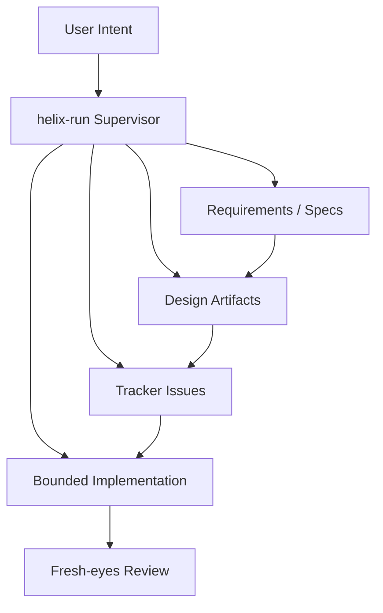

---
dun:
  id: SD-001
  depends_on:
    - FEAT-001
    - ADR-001
---
# Solution Design

## Scope

**Feature**: [[FEAT-001-helix-supervisory-control]] | **PRD**: [[helix.prd]] | **ADR**: [[ADR-001]]

## Acceptance Criteria

1. **Given** a HELIX-managed repository with governing artifacts, **When** the
   operator enters or resumes `helix-run`, **Then** HELIX selects the
   highest-leverage bounded next action that can be taken safely without human
   input.
2. **Given** a user-requested functionality change, **When** the change has
   downstream implications for specs or designs, **Then** HELIX routes work to
   reconciliation or planning before implementation continues.
3. **Given** changed specs or designs and open tracker issues, **When**
   `helix-run` evaluates the next step, **Then** HELIX refines the issue queue
   before implementation resumes.
4. **Given** ready issues governed by sufficient upstream artifacts, **When**
   `helix-run` advances execution, **Then** it prefers bounded implementation
   followed by fresh-eyes review.
5. **Given** ambiguity, missing authority, or product judgment requirements,
   **When** HELIX cannot proceed safely, **Then** it stops and requests human
   guidance instead of guessing.

## Solution Approaches

**Selected Approach**: Model `helix-run` as a supervisory controller over the HELIX
artifact stack and tracker state. Treat companion commands and skills as
triggered subroutines inside that control loop while preserving their direct
interactive entrypoints.

**Key Decisions**:
- `helix-run` is the default autonomous control surface: users should not need
  to restate phase transitions explicitly once HELIX has sufficient authority.
- `helix-run` must remain responsive to concurrent local refinement activity:
  tracker and governing-artifact changes are new supervisory input, not noise.
- Next-step selection follows the principle of least power: prefer refining,
  reconciling, or polishing existing artifacts before escalating to broader
  changes.
- Companion actions remain directly invocable, but they are no longer peers in
  the product model; they are intervention points inside one shared control
  system.
- Stop-for-guidance is a first-class outcome whenever safe progress depends on
  human judgment, approval, prioritization, or missing source-of-truth
  artifacts.
- HELIX is packaged as one skill system: `skills/` contains entrypoints and
  skill-local assets, while `workflows/` contains shared resources consumed by
  multiple HELIX skills.
- Plugin and enterprise distribution must preserve package-relative access from
  every HELIX skill to the shared `workflows/` library.

**Trade-offs**:
- Gain: lower orchestration burden and better continuity across phases.
- Lose: a simpler "bag of commands" mental model; the supervisory contract must
  be documented and tested more carefully.

## Component Changes

### Component: `helix-run` supervisory loop
- **Current State**: `helix-run` is primarily framed as a bounded loop around
  ready implementation work plus queue-drain decisions.
- **Changes**: Expand `helix-run` into a supervisory controller that can detect
  which workflow layer is weakest and route to the appropriate bounded action:
  align, plan, polish, implement, review, check, or backfill. Revalidate the
  selected issue before claim and before close so concurrent refinement causes
  a controlled re-check instead of stale execution.

### Component: Skill trigger model
- **Current State**: HELIX skills are described mainly as direct mirrors of CLI
  commands and tend to activate only when the user asks for a literal command.
- **Changes**: Skill descriptions and guidance must encode state-based
  activation rules so HELIX can steer users through the workflow rather than
  waiting for explicit command recall.

### Component: Tracker refinement support
- **Current State**: The tracker captures execution state but does not yet
  expose all metadata mutation surfaces needed by higher-order refinement
  workflows.
- **Changes**: The supervisory model assumes issue refinement remains
  tracker-first and may require richer metadata updates to support polish,
  alignment, execution-class selection, and issue supersession cleanly.

### Component: Workflow contract
- **Current State**: The workflow docs emphasize bounded actions, but they do
  not yet define the supervisory trigger chain tightly enough.
- **Changes**: Normative docs must encode the transition rules among
  requirement change detection, reconciliation/planning, issue refinement,
  implementation, review, and escalation.

### Component: Package layout and resource resolution
- **Current State**: HELIX resources are referenced from skills, but the
  package/distribution contract for preserving those references is implicit.
- **Changes**: Treat `workflows/` as the shared resource library for multi-skill
  assets, keep skill-local assets under `skills/<skill>/`, and define installs
  that omit the shared library as invalid.

## Domain Model



### Business Rules
1. Least-power routing: HELIX must choose the smallest sufficient next action
   that restores progress.
2. Human intervention by exception: HELIX must stop when authority, approval,
   or product judgment is missing.
3. Interactive continuity: direct command use must not create a separate
   control model from `helix-run`.
4. Shared-resource integrity: any HELIX skill that depends on `workflows/`
   assumes the full HELIX package layout is present.
5. Queue drift visibility: concurrent local tracker or spec changes must be
   observed at safe execution boundaries before claim or close.

## API/Interface Design

```yaml
supervisor_inputs:
  user_intent:
    - functionality_change
    - artifact_revision
    - execution_request
    - review_request
    - metric_goal
  artifact_state:
    - vision
    - prd
    - feature_specs
    - designs
    - tests
    - tracker_issues
  readiness:
    - ready_issues
    - blocked_issues
    - authority_gaps
    - ambiguity_gaps
supervisor_outputs:
  next_action:
    - align
    - plan
    - polish
    - implement
    - review
    - check
    - backfill
    - guidance
  rationale:
    - least_power_explanation
    - blocking_authority
    - queue_drift_reason
package_layout:
  root:
    - skills/
    - workflows/
  rules:
    - multi_skill_shared_assets_live_in_workflows
    - single_skill_assets_live_with_the_skill
    - installs_must_preserve_package_relative_paths
    - incomplete_skill_only_installs_are_invalid
```

## Traceability

| Requirement ID | Component | Design Element | Test Strategy |
|---------------|-----------|----------------|---------------|
| FR-001 | `helix-run` | Supervisory loop selects next bounded action | Scenario tests for state transitions |
| FR-002 | Skill trigger model | Functionality changes route to align/plan | Skill and workflow contract coverage |
| FR-003 | Tracker integration | Spec changes with open work route to polish | Tracker + loop integration tests |
| FR-004 | Review handling | Implementation is followed by review | Deterministic wrapper review tests |
| FR-005 | Escalation boundaries | Guidance stop on missing authority | Negative-path tests |
| FR-006 | Package layout | Shared assets resolve from `workflows/` across skills | Packaging validation and install tests |

### Gaps
- [ ] Tracker metadata mutation still needs first-class CLI support for
      refinement workflows such as `--refs`.

## Data Model Changes

```yaml
tracker_metadata_extensions:
  required_capabilities:
    - update_spec_id
    - update_parent
    - update_deps
    - update_refs
  rationale: issue refinement and reconciliation need first-class metadata
    mutation, not direct JSONL surgery
packaging_contract:
  shared_library: workflows/
  skill_local_assets: skills/<skill>/
  invalid_install: skill present without required shared resources
```

## Integration Points

| From | To | Method | Data |
|------|-----|--------|------|
| User conversation | `helix-run` supervisor | Intent classification | functionality changes, direct requests, approvals, ambiguity |
| `helix-run` | `align` / `plan` | Triggered subroutine | requirement and design drift |
| `helix-run` | `polish` | Triggered subroutine | changed specs plus open issues |
| `helix-run` | `implement` | Triggered subroutine | ready governed issues |
| `helix-run` | `review` | Triggered subroutine | recent implementation results |
| `helix-run` | tracker | Query/update | issue state, dependencies, metadata, claims |
| Companion commands | `helix-run` model | Shared control semantics | direct interactive intervention without model drift |
| HELIX skill pack | shared `workflows/` library | Package-relative file access | actions, templates, metadata, conventions |

### External Dependencies
- **Tracker CLI**: source of durable execution state | Fallback: stop and
  require guidance if tracker state cannot be trusted
- **Workflow docs**: source of normative action semantics | Fallback: escalate
  rather than improvise unsupported behavior

## Security

- **Authentication**: Not applicable as a product auth surface; the design is
  about local workflow control.
- **Authorization**: Authority order is the effective authorization boundary.
  HELIX may not override higher-order artifacts based on convenience.
- **Data Protection**: Tracker and artifact modifications must remain explicit
  and inspectable.
- **Threats**: Silent overreach, hidden state transitions, and acting without
  sufficient authority. Mitigation is bounded actions plus explicit
  stop-for-guidance behavior.

## Performance

- **Expected Load**: Local repository-scale orchestration with repeated small
  state evaluations.
- **Response Target**: Choose the next action quickly enough that supervision
  feels continuous in an interactive session.
- **Optimizations**: Prefer small state checks over broad rescans; avoid
  unnecessary full-workflow passes when a narrower action is sufficient.

## Testing

- [ ] **Unit**: next-action selection logic for representative state
      transitions
- [ ] **Integration**: `run` -> `align/plan` -> `polish` -> `implement` ->
      `review` handoffs
- [ ] **API**: tracker metadata update flows required by issue refinement
- [ ] **Concurrency**: operator refinement during a live run causes
      revalidation before claim and before close
- [ ] **Packaging**: installs preserve `skills/` plus `workflows/` and shared
      references resolve correctly
- [ ] **Security**: stop-for-guidance behavior on ambiguity or missing
      authority

## Constraints & Assumptions

- **Constraints**: Preserve bounded actions, authority order, and tracker-first
  execution.
- **Assumptions**: Existing workflow docs and skills can be updated to reflect
  the supervisory model without inventing a new artifact taxonomy.
- **Dependencies**: PRD, ADR-001, tracker contract, workflow contract docs,
  mirrored HELIX skills, and installers that preserve the HELIX package root.

## Migration & Rollback

- **Backward Compatibility**: Direct commands remain available and continue to
  mirror public skill names.
- **Data Migration**: None required for the design artifact itself; tracker
  schema changes may require additive metadata support later.
- **Feature Toggle**: The supervisory model can be introduced first in docs and
  skill guidance before deeper CLI automation changes land.
- **Rollback**: Revert to the narrower bounded-loop interpretation of
  `helix-run`, but this would contradict the current vision and PRD.

## Implementation Sequence

1. Encode the supervisory model in product/design docs
   -- Files: `docs/helix/00-discover/product-vision.md`,
   `docs/helix/01-frame/prd.md`,
   `docs/helix/01-frame/features/FEAT-001-helix-supervisory-control.md`,
   `docs/helix/02-design/adr/ADR-001-supervisory-control-model.md`,
   `docs/helix/02-design/solution-designs/SD-001-helix-supervisory-control.md`
   -- Tests: n/a
2. Update workflow contract docs to express the trigger rules and escalation
   boundaries
   -- Files: `workflows/README.md`, `workflows/EXECUTION.md`,
   `workflows/REFERENCE.md`, `workflows/TRACKER.md`
3. Update skills and tracker/CLI implementation surfaces to follow the
   supervisory model
   -- Files: `skills/*/SKILL.md`, `scripts/helix`, `scripts/tracker.sh`,
   `tests/helix-cli.sh`

**Prerequisites**: Product vision, PRD, and ADR agreement on the supervisory
control model.

## Risks

| Risk | Prob | Impact | Mitigation |
|------|------|--------|------------|
| The design remains too abstract to implement consistently | M | H | Translate it into explicit workflow triggers and deterministic tests |
| The supervisory loop overreaches into product decisions | M | H | Keep stop-for-guidance and authority boundaries explicit |
| Tracker limitations block clean issue refinement | H | M | Add first-class metadata update support before relying on manual edits |
