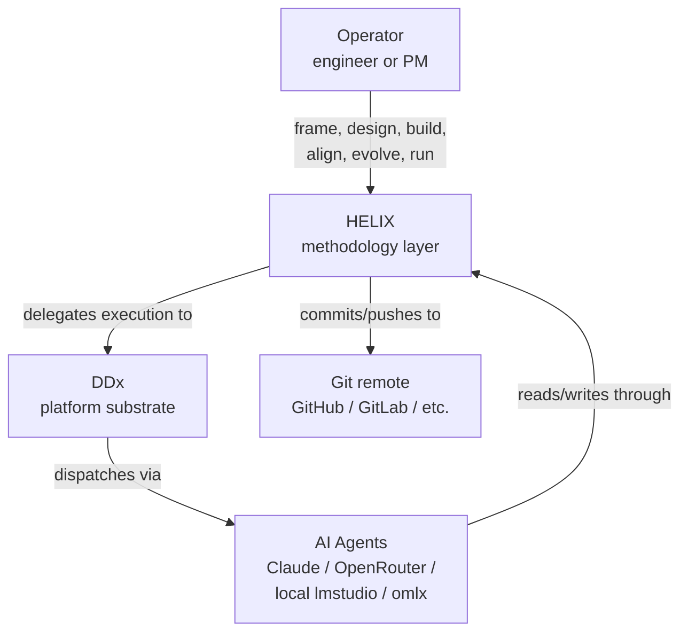
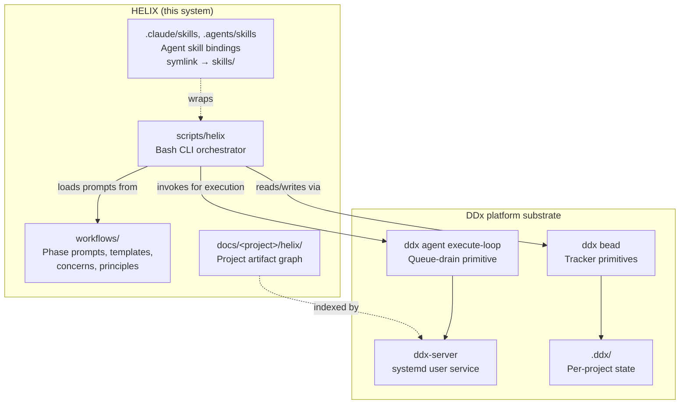
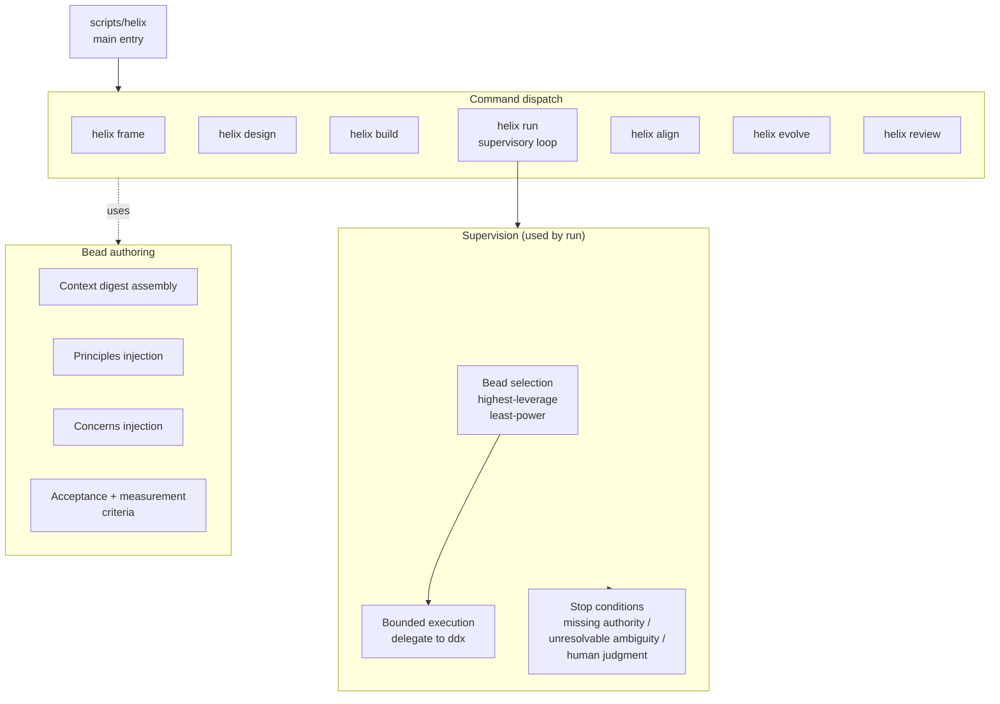
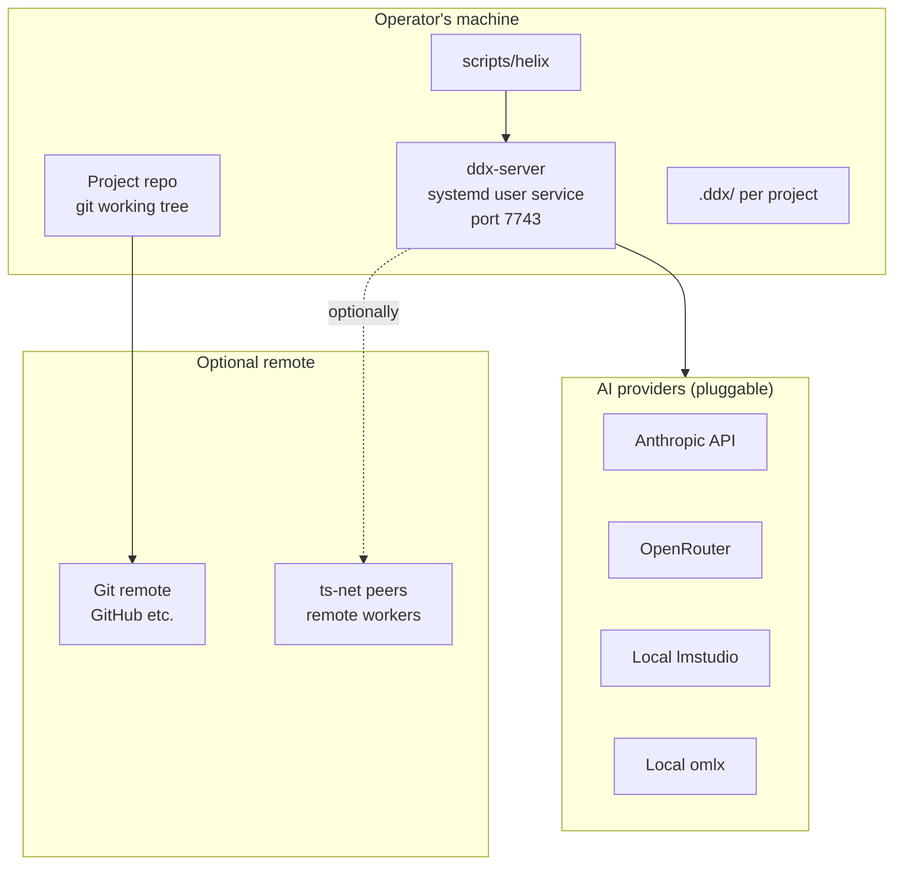

## What it is

Captures the C4 views the team needs to build and review the system —
System Context, Container, Component (where helpful), Deployment, and
Data Flow — plus the quality attributes that constrain the design and
the architectural decisions that bind it. The architecture document is
the highest-authority structural artifact in the Design phase: solution
designs reference it, technical designs follow it, and operational
artifacts (runbook, monitoring, deployment) trace back to its quality
attributes.

## Phase

**[Phase 2 — Design](/reference/glossary/phases/)** — Decide how to build it. Capture trade-offs, contracts, and architecture decisions.

## Output location

`docs/helix/02-design/architecture.md`

## Relationships

### Requires (upstream)

- [PRD](../prd/) — defines system scope
- [Feature Specifications](../feature-specification/) — lists features to support
- [Security Requirements](../security-requirements/) — informs security architecture *(optional)*
- [Threat Model](../threat-model/) — guides security controls *(optional)*

### Enables (downstream)

- [Solution Design](../solution-design/) — feature-level designs reference architecture
- [Technical Design](../technical-design/) — implementation details follow architecture
- [ADR](../adr/) — documents architectural decisions

### Informs

- [Solution Design](../solution-design/)
- [Technical Design](../technical-design/)
- [Adr](../adr/)

### Referenced by

- [Deployment Checklist](../deployment-checklist/)
- [Runbook](../runbook/)
- [Monitoring Setup](../monitoring-setup/)

## Generation prompt

The agent prompt that produces this artifact.

<details>
<summary>Show the full generation prompt</summary>

``````markdown
# Architecture Documentation Generation Prompt
Document the architecture views that the team actually needs to build and review the system.

## Focus
- Include only the C4 views that add information; omit empty or duplicate views.
- Keep boundaries, deployment shape, data flow, and quality attributes visible.
- Annotate major tradeoffs or constraints directly on the relevant view or summary.
- Remove generic architecture commentary.

## Completion Criteria
- The views are understandable at a glance.
- Key boundaries and tradeoffs are visible.
- The document stays implementation-relevant.
``````

</details>

## Template

<details>
<summary>Show the template structure</summary>

``````markdown
---
ddx:
  id: helix.architecture
  depends_on:
    - helix.prd
---
# Architecture Diagrams

## Level 1: System Context

```mermaid
graph TB
    %% [Add users, system, external dependencies]
```

| Element | Type | Purpose | Protocol |
|---------|------|---------|----------|
| [User/System] | User/External | [Interaction] | [HTTP/API/etc] |

## Level 2: Container Diagram

```mermaid
graph TB
    %% [Add containers: Web, API, DB, Cache, Queue, Worker]
```

| Container | Technology | Responsibilities | Communication |
|-----------|------------|------------------|---------------|
| [Name] | [Stack] | [What it does] | [Protocol/Format] |

## Level 3: Component Diagram

```mermaid
graph TB
    %% [Add components per container: Controller, Service, Repository, etc]
```

| Component | Purpose | Implementation Notes |
|-----------|---------|---------------------|
| [Name] | [Responsibility] | [Key decisions] |

## Deployment

```mermaid
graph TB
    %% [Add: LB, Web Tier, App Tier, Data Tier]
```

| Component | Infrastructure | Instances | Scaling |
|-----------|---------------|-----------|---------|
| [Name] | [Container/VM] | [Count] | [H/V] |

## Data Flow

```mermaid
sequenceDiagram
    %% [Add sequence for key use case]
```

## Architecture Summary

| Layer | Technology | Rationale |
|-------|------------|-----------|
| Frontend | [Tech] | [Why] |
| Backend | [Tech] | [Why] |
| Database | [Tech] | [Why] |
| Infra | [Tech] | [Why] |

**Patterns**: [Pattern 1: usage] | [Pattern 2: usage]

## Quality Attributes

| Attribute | Strategy | Key Decisions |
|-----------|----------|---------------|
| Scalability | [H/V scaling] | [Approach] |
| Security | [Controls] | [Boundaries] |
| Observability | [Metrics/Logging/Tracing] | [Tools] |
| Disaster Recovery | RTO: [target] / RPO: [target] | [Backup/Failover strategy] |
``````

</details>

## Example

This example is HELIX's actual architecture, sourced from [`docs/helix/02-design/architecture.md`](https://github.com/DocumentDrivenDX/helix/blob/main/docs/helix/02-design/architecture.md). It shows how this artifact is used in a live methodology project; it may include project-specific context.

## Architecture

HELIX is a methodology layer running on the
[DDx](https://github.com/DocumentDrivenDX/ddx) platform substrate. Architecturally it is three things:

1. A **knowledge graph of artifacts** in `docs/<project>/helix/` that captures
   product, design, test, and operational intent across seven phases.
2. A **set of workflow tools** — `scripts/helix` and the agent skills that
   wrap it — that operate across the graph: select work, dispatch agents,
   review output, propagate change, and stop for human judgment.
3. A library of **prompts, templates, and concerns** in `workflows/` that
   define what each artifact is and how agents produce it.

These run on top of DDx, which provides the bead tracker, the agent
execution loop, document graph indexing, and execution-evidence storage.
The boundary between HELIX and DDx is codified in
[CONTRACT-001](https://github.com/DocumentDrivenDX/helix/blob/main/docs/helix/02-design/contracts/CONTRACT-001-ddx-helix-boundary.md): DDx owns
substrate; HELIX owns workflow semantics.

### Level 1: System Context



| Element | Type | Purpose | Protocol |
|---------|------|---------|----------|
| Operator | Human | Defines intent, approves gates, reviews output, steers via tracker | CLI (`scripts/helix`) |
| HELIX | This system | Workflow routing, supervision, artifact-flow policy, prompt strategy | Bash + Markdown + YAML |
| DDx | External substrate | Bead tracker, agent execution loop, graph index, execution evidence | gRPC/HTTP + CLI |
| AI Agents | External | Execute work per HELIX-authored prompts | OpenAI-compatible HTTP, Anthropic API, local LM Studio, MLX |
| Git remote | External | Source of truth, durable history, collaboration | SSH / HTTPS |

### Level 2: Container Diagram



| Container | Technology | Responsibilities | Communication |
|-----------|------------|------------------|---------------|
| `scripts/helix` | Bash + jq | Phase command dispatch, supervisory loop, bead authoring, escalation policy | shell, JSON via `ddx` CLIs |
| `workflows/` | Markdown + YAML | Phase prompts, artifact templates, concern declarations, principles | filesystem reads at runtime |
| `.claude/skills`, `.agents/skills` | Markdown (symlinks) | Agent-facing entry points; one per CLI verb | invoked by harness |
| `docs/<project>/helix/` | Markdown + YAML | The project's artifact graph (phase 0–6 outputs) | filesystem; DDx graph indexes it |
| `ddx-server` | Go | Long-running platform service: routing, indexing, evidence | systemd user service on port 7743 |
| `ddx bead` | Go (CLI) | Tracker primitives (create, claim, ready, close, list) | invoked by `scripts/helix` |
| `ddx agent execute-loop` | Go (CLI) | Bounded queue-drain: claim → dispatch → close-or-preserve | invoked by `helix run` |
| `.ddx/` | JSONL + dirs | `beads.jsonl` tracker, `executions/`, `plugins/`, runtime state | scripts/helix and DDx both read |

### Level 3: Component Diagram (`scripts/helix` only)

Most containers are simple. The non-trivial one is the orchestrator.



| Component | Purpose | Implementation Notes |
|-----------|---------|---------------------|
| Command dispatch | Route operator verbs to phase modules | Bash `case` over arg-1; each verb in `workflows/phases/<phase>/` |
| Bead selection | Pick highest-leverage least-power next move | Reads `ddx bead ready --json`; applies HELIX-side priority and least-power filters |
| Bounded execution | Delegate one bead to DDx | Calls `ddx agent execute-loop --once`; HELIX does not own the inner loop mechanics |
| Stop conditions | Detect ungovernable next moves | Checks for missing upstream authority, unresolvable artifact contradiction, P0 product questions |
| Context digest | Assemble compact upstream summary at triage | Pulls principles + active concerns + relevant ADRs into a `<context-digest>` block on the bead |
| Principles injection | Inject project + HELIX defaults | Per FEAT-003; loaded from `docs/helix/01-frame/principles.md` or HELIX defaults |
| Concerns injection | Inject active project concerns | Per FEAT-006; loaded from `docs/helix/01-frame/concerns.md`, expanded from `workflows/concerns/` |
| Acceptance authoring | Make beads execute-loop-closeable | Deterministic acceptance + success-measurement criteria so DDx can close on success without manual judgment |

### Deployment

HELIX is local-first. The default deployment is a single operator's
development machine.



| Component | Infrastructure | Instances | Scaling |
|-----------|---------------|-----------|---------|
| `ddx-server` | systemd user service | 1 per machine | per-operator; not shared |
| Project working trees | filesystem | many per operator | trivially horizontal |
| Workers | DDx agent harness processes | 1+ per server | H: more workers ⇒ more parallel beads, but per-project lock prevents two `helix run`s on the same repo |
| AI providers | external API or local LM Studio | per-provider | provider-managed |

Network: HELIX requires no inbound network. Outbound is optional —
local-only AI providers (lmstudio, omlx) keep the entire flow on the
operator's machine.

### Data Flow: One supervisory pass

```mermaid
sequenceDiagram
    participant op as Operator
    participant cli as scripts/helix
    participant tracker as ddx bead<br/>(.ddx/beads.jsonl)
    participant loop as ddx agent<br/>execute-loop
    participant agent as AI agent
    participant repo as project repo

    op->>cli: helix run
    cli->>cli: assemble supervisory<br/>bead set (review/<br/>align/evolve injection)
    cli->>loop: delegate execute-loop --once
    loop->>tracker: claim ready bead
    loop->>cli: load context digest<br/>(governing artifacts +<br/>concerns + principles)
    loop->>agent: dispatch with prompt
    agent->>repo: edit files, run tests
    agent->>loop: result + execution evidence
    loop->>repo: commit + merge (on success)
    loop->>tracker: close bead OR preserve attempt
    loop->>cli: emit result event
    cli->>cli: cross-model review<br/>(adversarial alternate)<br/>or stop for operator
    cli->>op: status (running, blocked, or stopped)
```

The loop continues until either no ready beads remain or one of the three
stop conditions fires. Operator-visible state lives in three places: the
tracker (`.ddx/beads.jsonl`), the artifact graph (`docs/helix/`), and
execution evidence (`.ddx/executions/`).

### Architecture Summary

| Layer | Technology | Rationale |
|-------|------------|-----------|
| CLI orchestrator | Bash + jq + ddx CLI | Local-first, scriptable, no compile step; workflow logic is mostly pipelines over `ddx` JSON |
| Workflow content | Markdown + YAML | Human-editable, agent-readable, version-controlled |
| Tracker | DDx beads (JSONL on disk) | Append-mostly, git-friendly, single-writer per project |
| Agent execution | DDx agent loop (Go) | Provided by substrate; HELIX does not reimplement |
| Document graph | DDx graph primitives | Provided by substrate; HELIX adds policy on top |
| Project state | `.ddx/` + `docs/<project>/helix/` | Local filesystem, committed to git where appropriate |

**Patterns**:

- **Methodology over substrate.** HELIX defines workflow semantics; DDx
  provides execution mechanics. CONTRACT-001 codifies the boundary so
  neither side accumulates the other's responsibilities.
- **Bounded autopilot.** Every supervisory pass has explicit stop
  conditions. The loop never runs unbounded; the operator is always
  one human-judgment moment away from being asked.
- **Authority order as control law.** Conflicts between artifacts resolve
  by deferring to the higher-authority layer. Implemented in `helix
  evolve` (propagates change downward) and `helix align` (audits
  consistency).
- **Pluggable providers.** HELIX is provider-agnostic; DDx routes to
  whatever provider is configured per tier. A project can run entirely
  locally (lmstudio + omlx) or escalate to remote frontier models.

### Quality Attributes

| Attribute | Strategy | Key Decisions |
|-----------|----------|---------------|
| Bounded autonomy | `helix run` has explicit stop conditions: missing authority, unresolvable ambiguity, human-judgment gate. | [ADR-001](https://github.com/DocumentDrivenDX/helix/blob/main/docs/helix/02-design/adr/ADR-001-supervisory-control-model.md) |
| Tracker write safety | Local single-writer per project with malformed-state surfacing; no transactional multi-writer pretense. | [ADR-002](https://github.com/DocumentDrivenDX/helix/blob/main/docs/helix/02-design/adr/ADR-002-tracker-write-safety-model.md) |
| Cross-model verification | Adversarial review via DDx tier escalation (cheap → standard → smart) and alternating harnesses on review beads. | DDx routing config per project |
| Authority-order coherence | `helix align` audits consistency across the artifact graph; produces alignment-review artifacts. | `workflows/phases/06-iterate/` |
| Local-first | All state on disk; ddx-server is a local user service; AI providers are pluggable, including fully local. | systemd user service, no inbound network |
| Observability | Per-bead execution evidence in `.ddx/executions/`; alignment reviews and metrics in `docs/helix/06-iterate/`. | bead event-log model |
| Concurrency safety | Per-project `helix run` advisory lock; second invocation exits 2 with the lock-holder PID. | parallel-run mutex (in TD-026) |

**Disaster recovery**: HELIX is an operator's local development tool;
recovery is `git clone` and reinstall. Project state lives in the repo
and `.ddx/`; everything else is reproducible from those.

### Decisions and Trade-offs

| Decision | Choice | Trade-off |
|---------|---------|-----------|
| Build vs adopt for tracker | Adopted DDx bead tracker | HELIX doesn't own tracker semantics; DDx owns the surface and may evolve it independently. Accepted because we want methodology decoupled from substrate. See [CONTRACT-001](https://github.com/DocumentDrivenDX/helix/blob/main/docs/helix/02-design/contracts/CONTRACT-001-ddx-helix-boundary.md). |
| Bash vs Go for orchestrator | Bash | Faster iteration on workflow logic; harder to test deeply. Acceptable because the workflow logic is mostly pipelines over `ddx` JSON output. See [TD-002](https://github.com/DocumentDrivenDX/helix/blob/main/docs/helix/02-design/technical-designs/TD-002-helix-cli.md). |
| Centralized server vs per-invocation | `ddx-server` long-running | Bead routing and provider state need persistence; per-invocation cold starts are slow. |
| Provider lock-in vs pluggability | Pluggable | Local-first development requires no network; remote providers are an option, not a requirement. |
| Synchronous vs async loop | Synchronous (`helix run` is foreground) | Easier to reason about supervision and stop conditions; doesn't preclude future async modes. |
| Single-writer vs multi-writer tracker | Single-writer per project | Avoids implementing distributed-transaction semantics that would be wasted at this scale. See [ADR-002](https://github.com/DocumentDrivenDX/helix/blob/main/docs/helix/02-design/adr/ADR-002-tracker-write-safety-model.md). |
| Reuse DDx execute-loop vs reimplement | Reuse | HELIX adds the supervisory wrapper, not the queue-drain mechanics. Keeps HELIX small and tightly scoped to workflow concerns. |

### References

- [ADR-001: Supervisory Control Model](https://github.com/DocumentDrivenDX/helix/blob/main/docs/helix/02-design/adr/ADR-001-supervisory-control-model.md)
- [ADR-002: Tracker Write Safety Model](https://github.com/DocumentDrivenDX/helix/blob/main/docs/helix/02-design/adr/ADR-002-tracker-write-safety-model.md)
- [CONTRACT-001: DDx / HELIX Boundary](https://github.com/DocumentDrivenDX/helix/blob/main/docs/helix/02-design/contracts/CONTRACT-001-ddx-helix-boundary.md)
- [SD-001: HELIX Supervisory Control](https://github.com/DocumentDrivenDX/helix/blob/main/docs/helix/02-design/solution-designs/SD-001-helix-supervisory-control.md)
- [SD-002: First-Class Principles](https://github.com/DocumentDrivenDX/helix/blob/main/docs/helix/02-design/solution-designs/SD-002-first-class-principles.md)
- [TD-002: HELIX CLI](https://github.com/DocumentDrivenDX/helix/blob/main/docs/helix/02-design/technical-designs/TD-002-helix-cli.md)
- [TD-003: HELIX Start/Stop](https://github.com/DocumentDrivenDX/helix/blob/main/docs/helix/02-design/technical-designs/TD-003-helix-start-stop.md)
- [TD-011: Slider Autonomy Implementation](https://github.com/DocumentDrivenDX/helix/blob/main/docs/helix/02-design/technical-designs/TD-011-slider-autonomy-implementation.md)
