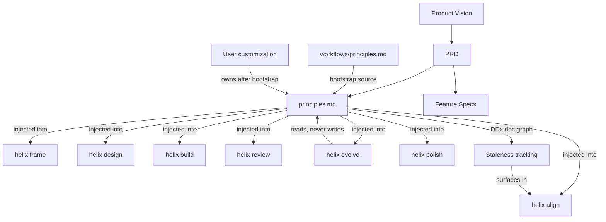

> **Source identity** (from `02-design/solution-designs/SD-002-first-class-principles.md`):

```yaml
ddx:
  id: SD-002
  depends_on:
    - FEAT-003
    - SD-001
```

# Solution Design: SD-002 — First-Class Principles

## Scope

**Feature**: [[FEAT-003-principles]] | **PRD**: [[helix.prd]] | **Depends**: [[SD-001]]

## Acceptance Criteria

1. **Given** a new HELIX-managed repository with no project principles,
   **When** any judgment-making skill runs, **Then** HELIX loads and applies
   the defaults from `workflows/principles.md`.
2. **Given** a repository where `helix frame` runs for the first time,
   **When** no `docs/helix/01-frame/principles.md` exists, **Then** HELIX
   bootstraps the file from defaults and prompts the user to customize.
3. **Given** a project principles file exists, **When** any skill runs,
   **Then** it loads principles exclusively from the project file, ignoring
   HELIX defaults.
4. **Given** a judgment-making action prompt (design, build, review, evolve,
   align, polish, frame), **When** it executes, **Then** the active
   principles appear in the prompt context.
5. **Given** a user adds a principle that tensions with an existing one,
   **When** the management action runs, **Then** it detects the tension and
   requires a resolution strategy before accepting the addition.
6. **Given** the project principles file changes, **When** the DDx document
   graph is evaluated, **Then** downstream artifacts that depend on
   principles are marked stale.
7. **Given** `helix evolve` runs, **When** it threads a change through the
   artifact stack, **Then** it reads and respects active principles but
   never modifies the principles file.

## Solution Approach

**Selected approach**: Treat principles as a read-only upstream artifact
that every judgment-making action loads at invocation time. No new runtime
infrastructure — the mechanism is prompt-level inclusion with a resolution
function that finds the active principles file.

**Key decisions**:

- Principles are a static markdown file, not a database or config object.
  Skills read the file; they do not query a service.
- The resolution order is simple: project file > HELIX defaults. No merge,
  no layering. If the project file exists, it is the complete source of
  truth.
- The current six "principles" in `workflows/principles.md` are workflow
  rules. They relocate to enforcers and ratchets. The file is rewritten
  with ~5 genuine design principles.
- Injection starts as a full-document preamble (baseline). Prompt
  engineering research (tracked separately) will iterate toward selective
  injection using DDx agent metrics.
- Principles are upstream of everything except vision and PRD. `helix evolve`
  reads them but never writes them. Only `helix frame` and direct user
  editing can modify principles.

**Trade-offs**:

- Gain: consistent judgment guidance across all skills; user-controllable
  project values.
- Lose: every judgment-making prompt grows by the size of the principles
  document. Mitigated by the size ceiling (warn at 8, nudge at 12, prune
  at 15+) and future selective injection.

## Component Changes

### Component: `workflows/principles.md` (HELIX defaults)

- **Current state**: Contains 6 items that are workflow rules (spec
  completeness, test-first, simplicity first, observable interfaces,
  continuous validation, feedback integration). Referenced by
  `workflows/ratchets.md`.
- **Changes**: Rewrite to contain ~5 genuine design principles. The
  illustrative set from FEAT-003:
  1. Design for change
  2. Design for simplicity
  3. Validate your work
  4. Make intent explicit
  5. Prefer reversible decisions
- **Migration**: The old workflow rules relocate to enforcers and ratchets
  (see relocation map below).

### Component: Workflow rule relocation

The six current "principles" map to existing enforcement surfaces:

| Current "Principle" | Relocation Target | Rationale |
|---|---|---|
| Specification Completeness | Frame phase enforcer + exit gate | Already partially enforced by `exit-gates.yml`; make explicit in enforcer |
| Test-First Development | Test phase enforcer + build phase enforcer | Build enforcer already says "test-driven"; strengthen the contract |
| Simplicity First | Design phase enforcer | Already present as "Simplicity by Default"; strengthen wording |
| Observable Interfaces | Design phase enforcer | Design concern about API surface and testability |
| Continuous Validation | Ratchets (`workflows/ratchets.md`) | Already referenced by ratchets as Principle 5; update to be self-contained |
| Feedback Integration | Iterate phase + ratchets | Already referenced by ratchets as Principle 6; move fully into iterate phase |

After relocation, `workflows/ratchets.md` must update its references from
"Principle 5/6" to point at the new locations.

### Component: Principles artifact scaffolding

**Files**: `workflows/phases/01-frame/artifacts/principles/`

- **meta.yml**: Remove the broken `"Article \\d+:"` validation pattern.
  Update `required_sections` to match the new template. Remove the
  nonexistent `example.md` reference. Update `output.location` to
  `docs/helix/01-frame/principles.md`.
- **template.md**: Rewrite to reflect the two-layer model. Include the
  tension resolution section. Remove placeholder brackets.
- **prompt.md**: Expand to include the bootstrap conversation flow:
  project values, trade-off preferences, past mistakes. Include tension
  detection guidance and the size ceiling thresholds.

### Component: Principles resolution function

A shared resolution pattern used by all skills that need principles:

```
## Principles Resolution

1. Check: does `docs/helix/01-frame/principles.md` exist and have content?
   - Yes → load it as the active principles document.
   - No → load `workflows/principles.md` (HELIX defaults).
2. Include the active principles in the prompt preamble.
```

This is not a shell function or library — it is a documented pattern that
each action prompt follows. The pattern is defined once in a shared
reference file (`workflows/references/principles-resolution.md`) and
action prompts reference it.

### Component: Action prompt injection

Each judgment-making action prompt adds a principles loading step to its
Phase 0 / bootstrap section:

| Action Prompt | File | Injection Point |
|---|---|---|
| Implementation | `workflows/actions/implementation.md` | Phase 0 (Bootstrap) — load alongside quality gates |
| Fresh-eyes review | `workflows/actions/fresh-eyes-review.md` | Phase 0 (Identify Review Target) — load as review criteria |
| Plan/Design | `workflows/actions/plan.md` | Before first refinement round — load as design guidance |
| Evolve | `workflows/actions/evolve.md` | Phase 1 (Requirement Analysis) — load as scoping guidance |
| Reconcile-alignment | `workflows/actions/reconcile-alignment.md` | Phase 0 — load as alignment criteria |
| Polish | `workflows/actions/polish.md` | Bootstrap — load as refinement guidance |
| Frame | `workflows/actions/frame.md` | Bootstrap — load to shape requirements priorities |
| Check | `workflows/actions/check.md` | Not injected — check is mechanical queue evaluation, not judgment |
| Backfill | `workflows/actions/backfill-helix-docs.md` | Not injected — backfill reconstructs what exists, does not make design choices |
| Experiment | `workflows/actions/experiment.md` | Bootstrap — load to inform metric selection and experiment design |

The injection preamble for the initial (baseline) implementation:

```markdown
## Active Principles

{contents of the resolved principles document}

Apply these principles when making judgment calls in this task.
When two options are both valid, prefer the one that better aligns
with the principles above.
```

### Component: Bootstrap in `helix frame`

The frame action (`workflows/actions/frame.md`) and frame skill
(`skills/helix-frame/SKILL.md`) gain a principles bootstrap step:

1. Check whether `docs/helix/01-frame/principles.md` exists.
2. If not, read `workflows/principles.md` (HELIX defaults).
3. Present the defaults to the user and ask:
   - "What does your project value most?"
   - "What trade-offs do you consistently lean toward?"
   - "What past mistakes should these principles help you avoid?"
4. Synthesize user input + defaults into a project principles document.
5. Run tension detection on the result.
6. Write `docs/helix/01-frame/principles.md`.
7. The user owns the file from this point forward.

### Component: Principle management

Principle management lives within `helix frame` as a sub-capability (not
a separate skill). When invoked with a principles-related intent:

**Tension detection algorithm**:

1. Parse each principle into a short semantic summary.
2. For each pair of principles, evaluate whether they could pull in
   opposite directions for a realistic decision.
3. For each detected tension, check whether the tension resolution section
   already addresses it.
4. Flag unresolved tensions to the user with a concrete example scenario
   where the two principles conflict.
5. Accept the user's resolution strategy and add it to the tension
   resolution section.

**Size ceiling enforcement**:

- At 8 principles: "Consider whether all of these are decision-changing."
- At 12 principles: "The Agile Manifesto has 12 and most teams can name
  maybe 4-5. Consider consolidating."
- At 15+: "This has grown beyond a decision framework into a wish list.
  Strongly recommend pruning to the principles that actually change
  decisions."

### Component: DDx document graph integration

Principles are an upstream dependency of all judgment-making artifacts.
The DDx document graph should track this relationship:

```
principles.md
  └── depends_on_by: [SD-*, ADR-*, TP-*, implementation artifacts]
```

When `principles.md` changes (detected via git diff or file watcher),
downstream artifacts that declare a dependency on principles are marked
stale. This surfaces in `helix align` as artifacts needing re-review.

**DDx capability gap assessment**: If the DDx document graph does not
currently support:

- Declaring a file as an upstream dependency of artifact categories
- Marking dependents as stale when the upstream changes
- Surfacing stale artifacts in alignment checks

...then these capabilities need to be requested as beads on the DDx
repository. This solution design does not implement DDx features; it
declares the interface it needs.

### Component: Enforcer updates

Phase enforcers that currently have their own inline "Core Principles You
Enforce" sections (build, design, test, etc.) should be reviewed:

- Enforcers keep their phase-specific rules (these are enforcement
  concerns, not cross-cutting principles).
- The relocated workflow rules from `workflows/principles.md` are absorbed
  into the appropriate enforcers as enforcement rules, not as "principles."
- Enforcers do not load or inject the project principles document. They
  enforce process; principles guide judgment. Different concerns.

## Domain Model



### Business Rules

1. **Single source**: at any time, exactly one principles document is
   active. Never merge or layer.
2. **User sovereignty**: the user can modify or delete any principle,
   including HELIX defaults. HELIX warns but does not block.
3. **Read-only downstream**: no skill except frame may write to the
   principles file. Evolve, design, build, review — all read-only.
4. **Size ceiling**: management skill enforces progressive warnings at
   8/12/15+ principles.
5. **Tension coherence**: unresolved tensions must be flagged before the
   principles document is considered complete.

## API/Interface Design

```yaml
principles_resolution:
  inputs:
    project_path: docs/helix/01-frame/principles.md
    default_path: workflows/principles.md
  logic:
    - if project_path exists and has content:
        active: project_path
    - else:
        active: default_path
  output:
    active_principles: string  # full markdown content

injection_preamble:
  format: |
    ## Active Principles
    {active_principles}

    Apply these principles when making judgment calls in this task.
    When two options are both valid, prefer the one that better aligns
    with the principles above.

bootstrap_conversation:
  triggers:
    - helix frame with no existing principles file
    - explicit user request to initialize principles
  questions:
    - "What does your project value most?"
    - "What trade-offs do you consistently lean toward?"
    - "What past mistakes should these principles help you avoid?"
  output:
    file: docs/helix/01-frame/principles.md

tension_detection:
  input: list of principles
  output:
    - pairs with potential tension
    - example scenarios for each tension
    - whether existing resolution section covers it
  thresholds:
    warn: 8
    nudge: 12
    strong_recommend: 15
```

## Traceability

| Requirement (FEAT-003) | Component | Design Element | Test Strategy |
|---|---|---|---|
| FR-1: Ship design defaults | `workflows/principles.md` | Rewritten with ~5 design principles | Content review; ensure no workflow rules remain |
| FR-2: Relocate workflow rules | Enforcers + ratchets | Relocation map above | Grep for orphaned references to old principle numbers |
| FR-3: Default fallback | Resolution function | Project file > defaults | Test with and without project file |
| FR-4: Bootstrap on frame | Frame action + skill | Bootstrap conversation flow | End-to-end frame run on empty project |
| FR-5: Project precedence | Resolution function | Single-source rule | Test that defaults are ignored when project file exists |
| FR-6: Downstream injection | All judgment action prompts | Preamble injection at Phase 0 | Verify each action prompt includes resolution step |
| FR-7: Update scaffolding | meta.yml, template.md, prompt.md | Rewritten to match new design | Validation checks pass on new template |
| FR-8: Tension detection | Management sub-capability | Pairwise evaluation + flagging | Test with known-conflicting principle pairs |
| FR-9: Tension resolution section | Template + management | Resolution section in template | Test that tensions produce resolution prompts |

### Gaps

- [ ] DDx document graph may need new features for upstream dependency
      tracking. Assessment needed; beads opened on DDx repo if required.
- [ ] Prompt engineering research needed to move from full-document
      baseline to selective injection. Tracked as separate research bead.

## Integration Points

| From | To | Method | Data |
|---|---|---|---|
| Any judgment skill | Principles resolution | File read at invocation | Active principles document content |
| `helix frame` | Principles bootstrap | Conversation + file write | User input + defaults → project principles |
| `helix frame` | Tension detection | Pairwise analysis | Principle pairs, conflict scenarios |
| Principles file | DDx document graph | Dependency declaration | Upstream of judgment artifacts |
| DDx document graph | `helix align` | Staleness surfacing | List of artifacts needing re-review |
| `helix evolve` | Principles file | Read-only load | Principles as scoping guidance |
| Old `workflows/principles.md` rules | Enforcers + ratchets | One-time relocation | Rules absorbed into enforcement surfaces |

### External Dependencies

- **DDx document graph**: needed for staleness tracking when principles
  change. If missing, principles still work — staleness just isn't
  automated until DDx catches up.
- **DDx agent metrics**: needed for prompt engineering research on
  injection effectiveness. Not a blocker for initial implementation.

## Security

- **Authorization**: Principles are upstream authority. No skill may write
  to the principles file except through explicit `helix frame` invocation
  or direct user editing.
- **Data Protection**: Principles are committed to git. No secrets should
  appear in principles.
- **Threats**: A corrupted or adversarial principles file could degrade
  agent judgment (e.g., "never validate anything"). Mitigated by: user
  owns the file, management skill warns about HELIX-breaking principles,
  and `helix align` can audit principle-to-artifact coherence.

## Performance

- **Expected load**: One file read per skill invocation. Negligible I/O.
- **Prompt size impact**: The principles document is included in every
  judgment-making prompt. At ~5 principles, this is ~500 tokens. At 12,
  ~1200 tokens. The size ceiling keeps this bounded.
- **Optimization path**: Selective injection (research-dependent) would
  reduce per-prompt token cost by including only relevant principles.

## Testing

- [ ] **Resolution logic**: project file present → loads project; project
      file absent → loads defaults; project file empty → falls back to
      defaults with warning
- [ ] **Bootstrap flow**: `helix frame` on empty project creates principles
      file from defaults + user input
- [ ] **Injection coverage**: every judgment-making action prompt includes
      the resolution step (grep/audit test)
- [ ] **Tension detection**: known-conflicting pairs are flagged; known-
      compatible pairs are not; resolution section addresses flagged pairs
- [ ] **Size ceiling**: warnings trigger at 8, 12, 15+ thresholds
- [ ] **Evolve read-only**: `helix evolve` loads principles but does not
      modify the file
- [ ] **Relocation completeness**: no orphaned references to old
      workflow-rule principle numbers in enforcers, ratchets, or action
      prompts
- [ ] **Ratchet reference update**: `workflows/ratchets.md` references
      updated from "Principle 5/6" to new enforcer/iterate locations

## Constraints & Assumptions

- **Constraints**: No new runtime infrastructure. Principles are a file
  read, not a service call. The resolution pattern is documented, not
  coded.
- **Assumptions**: ~5 design principles at ~100 tokens each is acceptable
  prompt overhead for every judgment-making skill. DDx document graph
  either supports or will support upstream dependency tracking.
- **Dependencies**: FEAT-003, SD-001 (supervisory control must support
  principles injection in the run loop), DDx document graph (for
  staleness tracking).

## Migration & Rollback

- **Backward compatibility**: Skills that do not yet include the
  resolution step simply operate without principles, as they do today.
  Injection can be rolled out incrementally per action prompt.
- **Data migration**: The rewrite of `workflows/principles.md` is a
  content change, not a schema change. Git history preserves the old
  content.
- **Rollback**: Revert the `workflows/principles.md` rewrite and remove
  injection preambles from action prompts. No structural damage.

## Implementation Sequence

### Slice 1: Rewrite defaults and relocate workflow rules
- Rewrite `workflows/principles.md` with ~5 design principles
- Relocate the six workflow rules to enforcers and ratchets
- Update `workflows/ratchets.md` references
- **Files**: `workflows/principles.md`, `workflows/ratchets.md`,
  `workflows/phases/*/enforcer.md`
- **Tests**: Grep for orphaned old-principle references

### Slice 2: Update artifact scaffolding
- Rewrite meta.yml, template.md, prompt.md under
  `workflows/phases/01-frame/artifacts/principles/`
- **Files**: `workflows/phases/01-frame/artifacts/principles/*`
- **Tests**: Validation checks against updated meta.yml

### Slice 3: Create resolution reference and inject into action prompts
- Write `workflows/references/principles-resolution.md`
- Add resolution + injection preamble to each judgment-making action prompt
- **Files**: `workflows/references/principles-resolution.md`,
  `workflows/actions/{implementation,fresh-eyes-review,plan,evolve,
  reconcile-alignment,polish,frame,experiment}.md`
- **Tests**: Audit that each judgment action includes the resolution step

### Slice 4: Bootstrap in helix frame
- Add bootstrap logic to `workflows/actions/frame.md` and
  `skills/helix-frame/SKILL.md`
- **Files**: `workflows/actions/frame.md`, `skills/helix-frame/SKILL.md`
- **Tests**: End-to-end frame run on project without principles file

### Slice 5: Tension detection and size management
- Add tension detection and size ceiling logic to the frame action's
  principles management sub-capability
- **Files**: `workflows/actions/frame.md` (principles management section)
- **Tests**: Known-conflicting pairs flagged; size thresholds trigger

### Slice 6: DDx document graph integration
- Assess DDx document graph capabilities for upstream dependency tracking
- If gaps exist, open beads on DDx repo
- If sufficient, declare principles as upstream dependency in graph
- **Files**: DDx repo (if beads needed), project doc-graph config
- **Tests**: Principle change marks downstream artifacts stale

### Slice 7: Prompt engineering research (ongoing)
- Design experiments comparing full-doc vs. selective injection
- Use DDx agent execution + metrics to measure alignment quality
- Iterate injection strategy based on evidence
- **Files**: Research notes, DDx experiment configs
- **Tests**: Measurable difference in agent alignment with principles

**Prerequisites**: Slices 1-2 have no dependencies. Slice 3 depends on
Slice 1 (needs the rewritten defaults to inject). Slice 4 depends on
Slices 1-3. Slice 5 depends on Slice 4. Slice 6 can run in parallel with
Slices 3-5. Slice 7 depends on Slice 3 (needs injection baseline to
measure).

## Risks

| Risk | Prob | Impact | Mitigation |
|---|---|---|---|
| Principles injection has no measurable effect on agent behavior | M | H | Start with baseline, research selective injection, measure with DDx metrics |
| Prompt size overhead from principles reduces agent performance on primary task | L | M | Size ceiling at 12 principles; future selective injection |
| Users write principles that degrade HELIX behavior | L | M | Management skill warns; `helix align` audits coherence |
| DDx document graph lacks needed features, blocking staleness tracking | M | L | Principles work without staleness tracking; it's an enhancement, not a requirement |
| Workflow rule relocation leaves orphaned references | M | L | Grep-based audit test catches orphans |
