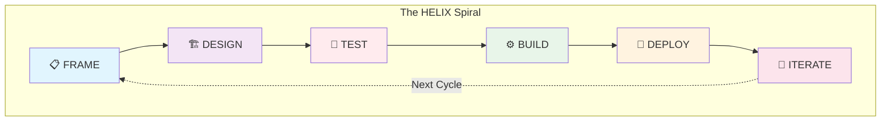
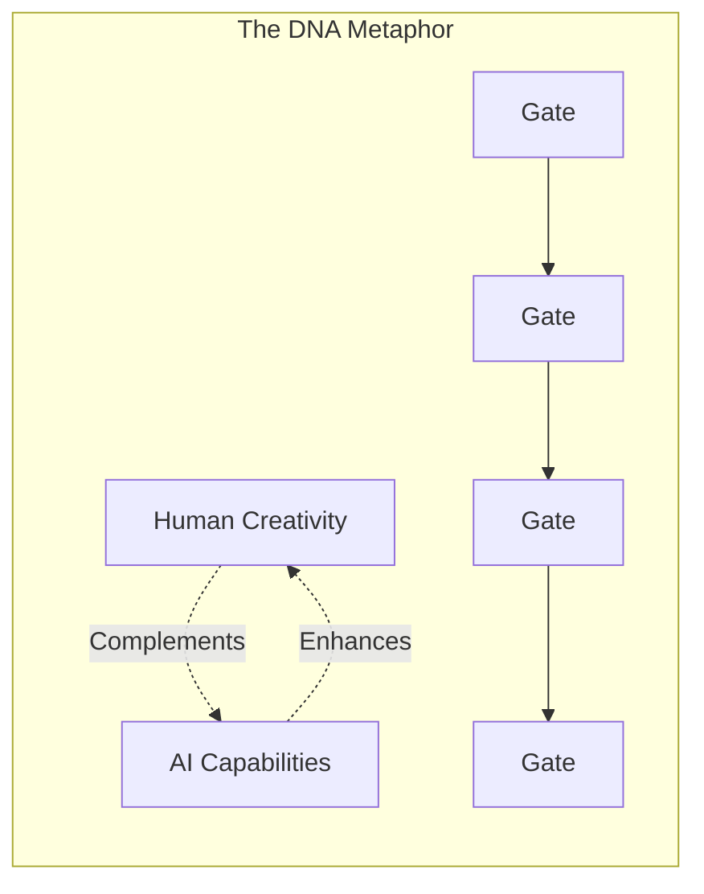

---
dun:
  id: helix.workflow
---
# HELIX Workflow

A test-driven development workflow with AI-assisted collaboration for building high-quality software iteratively.

> **Quick Links**: [DDx Methodology](DDX.md) | [Quick Start Guide](QUICKSTART.md) | [Visual Overview](diagrams/workflow-overview.md) | [Reference Card](REFERENCE.md) | [Execution Guide](EXECUTION.md) | [Artifact Flow](diagrams/artifact-flow.md) | [Quality Ratchets](ratchets.md)

## Overview

HELIX enforces Test-Driven Development (TDD) through a structured phase approach where tests are written BEFORE implementation. This ensures quality is built-in from the start and specifications are executable. Human creativity and AI capabilities collaborate throughout, with tests serving as the contract between design and implementation.

## Public Layers

HELIX exposes two public layers that should stay distinct in docs and tooling:

- Portable skill package surface:
  published at `.agents/skills`, mirrored to `~/.agents/skills`, with
  `~/.claude/skills` retained only as a temporary compatibility mirror.
- HELIX workflow and CLI contract:
  the stricter method defined in `workflows/`, the built-in tracker, and the
  `helix` wrapper commands that execute bounded actions.

Use the portable layer when you need standards-compliant skill packaging. Use
the workflow contract when you need HELIX-specific planning, queue control, and
execution semantics.

## Normative Contract

Treat the following files as the canonical HELIX workflow contract:

- [DDX.md](DDX.md) for the DDx methodology, artifact graph, and evolution model
- [README.md](README.md) for the high-level workflow model and authority order
- [EXECUTION.md](EXECUTION.md) for operator flow, queue control, and loop behavior
- DDx FEAT-004 (beads) for work-item storage, CRUD, and dependency management
- [check.md](actions/check.md) for queue-drain decisions
- [implementation.md](actions/implementation.md) for bounded execution work
- [reconcile-alignment.md](actions/reconcile-alignment.md) for top-down reconciliation
- [backfill-helix-docs.md](actions/backfill-helix-docs.md) for conservative documentation reconstruction
- [alignment-review.md](templates/alignment-review.md) and [backfill-report.md](templates/backfill-report.md) for durable review outputs

The rest of `workflows/` is supporting guidance, templates, phase
context, or examples. If a supporting document conflicts with the files above,
follow the normative contract and update the supporting document.

`workflows/` is also the shared HELIX resource library for assets consumed by
multiple HELIX skills. Skills are the operational entrypoints into HELIX; the
shared prompts, templates, metadata, and conventions they reuse live here.
Assets used by only one skill should live with that skill instead of here.

Additional actions extend the supervisory loop with bounded subroutines:

- [plan.md](actions/plan.md) for iterative design document creation behind the
  public `helix design` command surface
- [polish.md](actions/polish.md) for issue refinement before implementation
- [fresh-eyes-review.md](actions/fresh-eyes-review.md) for post-implementation review
- [evolve.md](actions/evolve.md) for threading requirement changes through the
  artifact stack and tracker
- [experiment.md](actions/experiment.md) for metric-driven optimization (execution tracked by issues, not HELIX docs)

`helix run` may dispatch `design`, `polish`, and `review` as supervisory
subroutines when repository state or user intent requires them. `design` and
`polish` are explicit queue-drain outcomes in the converged contract.
`review` remains a post-build supervisory step rather than a `NEXT_ACTION`
code. `evolve`, `triage`, and `status` are part of the public command surface
but are operator-steering or observability tools rather than queue-drain loop
actions. `experiment` remains operator-invoked only and is outside the
`helix run` supervisory dispatch model. If a supporting document conflicts
with the core normative contract above, follow the contract.

Supporting templates for metrics and reports:

- [metric-definition.yaml](templates/metric-definition.yaml) for shared metric definitions referenced by ratchets, experiments, and monitoring

## Command Mirroring

Public agent skills must mirror the CLI exactly.

- Agent skills use `helix-<command>`.
- CLI commands use `helix <command>`.
- `<command>` must be identical in both places.

Examples:

- `helix-run` <-> `helix run`
- `helix-build` <-> `helix build`
- `helix-align` <-> `helix align`
- `helix-review` <-> `helix review`
- `helix-design` <-> `helix design`
- `helix-status` <-> `helix status`
- `helix-triage` <-> `helix triage`
- `helix-evolve` <-> `helix evolve`

Do not publish extra skill names that have no matching CLI command.

## Skill Pack Layout

HELIX is packaged and installed as one skill system, not as isolated skill
folders.

- `.agents/skills/` is the canonical project-level skill package surface.
- `skills/` contains the underlying HELIX skill directories and skill-local
  resources that the project-level package surface points at.
- `workflows/` contains shared resources used by multiple HELIX skills.
- Installers, plugins, and enterprise packaging must preserve `.agents/skills/`,
  `skills/`, and `workflows/` together so package-relative references from
  skills to `workflows/` remain valid.
- A HELIX installation is incomplete if the project-level package surface is
  present without the underlying `skills/` and shared workflow resources it
  depends on.
- Published `SKILL.md` files must include `name` and `description`; include
  `argument-hint` when the mirrored CLI command accepts a trailing positional
  argument such as a scope, selector, or goal.
- `name` must match the published skill directory basename exactly.
- The deterministic package validator is `bash tests/validate-skills.sh`.



## Phases

0. **Discover** (optional) - Validate the opportunity before committing to Frame
1. **Frame** - Define the problem and establish context
2. **Design** - Architect the solution approach
3. **Test** - Write failing tests that define system behavior (Red phase)
4. **Build** - Implement code to make tests pass (Green phase)
5. **Deploy** - Release to production with monitoring
6. **Iterate** - Learn and improve for the next cycle

## Input Gates

Each phase after Frame has input gates that validate the previous phase's
outputs before allowing progression:

- **Design** cannot start until Frame outputs are validated
- **Test** cannot start until Design is reviewed and approved
- **Build** cannot start until Tests are written and failing (Red phase)
- **Deploy** cannot start until all Tests pass (Green phase)
- **Iterate** begins once the system is deployed and operational

This test-first approach ensures specifications drive implementation and quality is built in from the start.

## Authority Order

When HELIX artifacts disagree, resolve the conflict using this authority order:

1. **Product Vision** (`docs/helix/00-discover/product-vision.md`)
2. **Product Requirements** (`docs/helix/01-frame/prd.md`)
3. **Feature Specifications and User Stories** (`docs/helix/01-frame/features/`, `docs/helix/01-frame/user-stories/`)
4. **Architecture and ADRs** (`docs/helix/02-design/architecture.md`, `docs/helix/02-design/adr/`)
5. **Solution Designs and Technical Designs** (`docs/helix/02-design/solution-designs/`, `docs/helix/02-design/technical-designs/`)
   - `SD-XXX` solution designs are feature-level and describe the chosen
     approach for a feature or cross-component capability.
   - `TD-XXX` technical designs are story-level and describe one bounded
     implementation slice that inherits from a solution design.
6. **Test Plans and Executable Tests** (`docs/helix/03-test/`, `tests/`)
7. **Implementation Plans** (`docs/helix/04-build/implementation-plan.md`)
8. **Source Code and Build Artifacts** (`src/`, generated outputs)

### Conflict Resolution Rules

- Higher-order artifacts govern lower-order artifacts.
- Tests are executable specifications for the Build phase: code must satisfy tests, not the other way around.
- Tests do not override upstream requirements or design. If tests conflict with higher-order artifacts, return to the earlier phase and fix the inconsistency there.
- Source code is evidence of implementation, not the source of truth for requirements, design, or behavior.

## Tracker

The built-in tracker is HELIX's execution layer. Issues are stored in
`.helix/issues.jsonl` and managed via `helix tracker` subcommands.

- HELIX tracker guide: `helix tracker --help` (DDx FEAT-004)

- Issues are governed by the HELIX authority stack.
- Issues must cite the canonical artifacts that authorize the work.
- The tracker is the steering wheel for execution: operators and agents should
  express decomposition, blockers, supersession, and follow-up work through
  tracker primitives instead of out-of-band TODOs.
- Closing an issue records completion of a task; it does not redefine
  requirements, design, or tests.
- If issue execution changes behavior or scope, the governing canonical artifacts
  must be updated explicitly.

HELIX execution categories are expressed through native issue types,
parents, dependencies, `spec-id`, and labels rather than custom files:

- `phase:build` for story-level implementation work
- `phase:deploy` for story-level rollout work
- `phase:iterate` and `kind:backlog` for prioritized follow-up work
- `phase:review` and `kind:review` for reconciliation or audit work

## Execution

HELIX execution is intentionally bounded and uses a small set of top-level
actions:

- `build`: execute one ready execution issue and exit
- `check`: determine whether the next step is implementation, alignment,
  backfill, waiting, guidance, or stopping
- `design`: create or extend the design stack when supervisory routing detects
  missing design authority for the requested scope
- `polish`: refine ready or stale issues when specs changed before
  implementation resumes
- `reconcile-alignment`: run a top-down audit when the plan exists but the next
  execution set is unclear
- `fresh-eyes-review`: review completed implementation before additional
  execution continues when review automation is enabled
- `status`: expose persisted run-controller state, cycle timing, token usage,
  blockers, and next recommended action
- `evolve`: update governing artifacts and tracker issues when requirements
  change
- `triage`: create validated tracker issues with required steering metadata
- `backfill-helix-docs`: reconstruct missing HELIX docs conservatively from
  current evidence

Execution principles:

- tracker-as-steering-wheel: use tracker metadata as the shared execution
  control plane
- do-hard-things: use epic focus and bounded exponential backoff before giving
  up on governed work
- cross-model verification: prefer `--review-agent` or critique handoffs when
  review automation is enabled
- continuous useful work: absorb small adjacent work, stay within scope, and
  finish with blocker reports instead of silent stops

For operator flow, queue control, and bounded HELIX execution semantics, see
[EXECUTION.md](EXECUTION.md).

## Human-AI Collaboration

Throughout the workflow, responsibilities are shared:

### Human Responsibilities
- Problem definition and creative vision
- Strategic decisions and architecture choices
- Code review and quality assessment
- User experience and business logic

### AI Agent Responsibilities
- Pattern recognition and suggestions
- Code generation and refactoring
- Test case generation
- Documentation and analysis

## Security Integration

HELIX integrates security practices throughout every phase, following DevSecOps principles to ensure security is built-in rather than bolted-on:

### Security-First Approach
- **Frame**: Security requirements, threat modeling, and compliance analysis established upfront
- **Design**: Security architecture and controls designed into system structure
- **Test**: Security test suites created alongside functional tests
- **Build**: Secure coding practices and automated security scanning integrated
- **Deploy**: Security monitoring and incident response procedures activated
- **Iterate**: Security metrics tracked and security posture continuously improved

### Key Security Artifacts
- **Security Requirements**: Comprehensive security and compliance requirements
- **Threat Model**: STRIDE-based threat analysis with risk assessment
- **Security Architecture**: Defense-in-depth design with security controls
- **Security Tests**: Automated and manual security testing procedures
- **Security Monitoring**: Production security monitoring and alerting

### Security Quality Gates
Each phase includes security checkpoints that must be satisfied before progression, ensuring security requirements are met throughout the development lifecycle.

## Why HELIX? The Rationale

### The Problem with Traditional Development

Most software projects fail not because of technical challenges, but because of:
- **Unclear Requirements**: Building the wrong thing perfectly
- **Late Quality**: Finding bugs in production instead of development
- **Rework Cycles**: Constantly revisiting "completed" features
- **Human-AI Friction**: Unclear division of responsibilities
- **Security Afterthoughts**: Bolting on security instead of building it in

### How HELIX Solves These Problems

HELIX addresses these challenges through:

1. **Specification-First Development**: Requirements become executable tests
2. **Built-In Quality**: Tests written before code ensures quality from day one
3. **Clear Gates**: Can't proceed until previous phase is validated
4. **Human-AI Synergy**: Defined collaboration model maximizes both strengths
5. **Security Integration**: Security woven through every phase, not added later

### When to Use HELIX

HELIX is ideal for:
- ✅ **New products or features** requiring high quality and clear specifications
- ✅ **Mission-critical systems** where bugs are expensive
- ✅ **Teams practicing TDD** or wanting to adopt it
- ✅ **AI-assisted development** projects needing structure
- ✅ **Security-sensitive applications** requiring built-in security

HELIX may not be suitable for:
- ❌ **Prototypes or POCs** where speed matters more than quality
- ❌ **Simple scripts or tools** with minimal complexity
- ❌ **Emergency fixes** requiring immediate deployment
- ❌ **Teams unfamiliar with TDD** without time to learn

### HELIX vs Other Methodologies

| Aspect | HELIX | Agile/Scrum | Waterfall | Lean Startup |
|--------|-------|-------------|-----------|--------------|
| **Focus** | Quality & Specification | Flexibility | Predictability | Speed |
| **Testing** | Tests First (TDD) | Tests During | Tests After | Minimal Tests |
| **Documentation** | Comprehensive | Light | Heavy | Minimal |
| **AI Integration** | Built-in | Ad-hoc | None | Ad-hoc |
| **Best For** | Production Systems | General Development | Fixed Requirements | MVPs |

## Getting Started

```bash
# Quick start - initialize HELIX in your project
helix run

# Or follow the comprehensive guide
open workflows/QUICKSTART.md
```

For a detailed walkthrough, see our [Quick Start Guide](QUICKSTART.md) which includes a complete example of building a TODO API using HELIX.

## Why Test-First?

The HELIX workflow enforces writing tests before implementation because:

1. **Tests ARE the Specification** - Tests define exactly what the system should do
2. **Clear Definition of Done** - Implementation is complete when tests pass
3. **Prevents Over-Engineering** - Only write code needed to pass tests
4. **Built-in Quality** - Bugs are caught immediately, not later
5. **Refactoring Safety** - Green tests provide confidence to improve code

## The TDD Cycle

Within the Test and Build phases, we follow the Red-Green-Refactor cycle:

1. **Red** (Test Phase) - Write a failing test that defines desired behavior
2. **Green** (Build Phase) - Write minimal code to make the test pass
3. **Refactor** (Build Phase) - Improve code quality while keeping tests green

## The Helix Concept

The workflow name comes from the double helix structure of DNA, representing multiple layers of meaning:



- **Two Complementary Strands**: Human creativity and AI capabilities intertwine
- **Connection Points**: Quality gates ensure structural integrity
- **Ascending Spiral**: Each iteration builds on the previous, creating upward progress
- **Information Transfer**: Requirements transform through phases like genetic information
- **Evolution**: The system evolves and improves with each cycle

## Success Stories and Case Studies

### Case Study 1: E-Commerce Platform
- **Challenge**: Build secure payment processing with complex requirements
- **Approach**: 6-week HELIX cycle with heavy security focus
- **Results**:
  - Zero security vulnerabilities in first year
  - 99.99% uptime achieved
  - 60% reduction in post-launch bugs

### Case Study 2: Healthcare API
- **Challenge**: HIPAA-compliant patient data system
- **Approach**: HELIX with enhanced compliance gates
- **Results**:
  - Passed compliance audit on first attempt
  - All requirements traceable to tests
  - 40% faster than traditional approach

### Metrics from HELIX Adoption
- **80% reduction** in production bugs
- **50% faster** time to market for features
- **90% test coverage** achieved consistently
- **100% requirements** with corresponding tests

## Resources and Support

- 📚 **[Quick Start Guide](QUICKSTART.md)**: Get running in 5 minutes
- 🎨 **[Visual Diagrams](diagrams/)**: Workflow and artifact visualizations
- 📋 **[Reference Card](REFERENCE.md)**: Quick lookup for actions and concepts
- 🔄 **[Phase Guides](phases/)**: Deep dive into each phase
- 🛠️ **[Artifact Prompt Roots](REFERENCE.md)**: Canonical prompt and template directories by phase

## Contributing

HELIX is continuously improving based on practitioner feedback. To contribute:
- Share your experiences and case studies
- Suggest improvements to templates
- Report issues or gaps in documentation
- Submit pull requests with enhancements

---

*Start your HELIX journey today with `helix run`*
